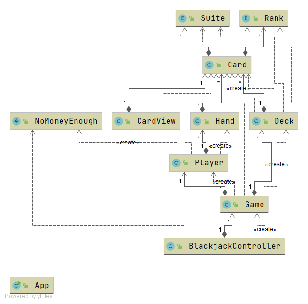
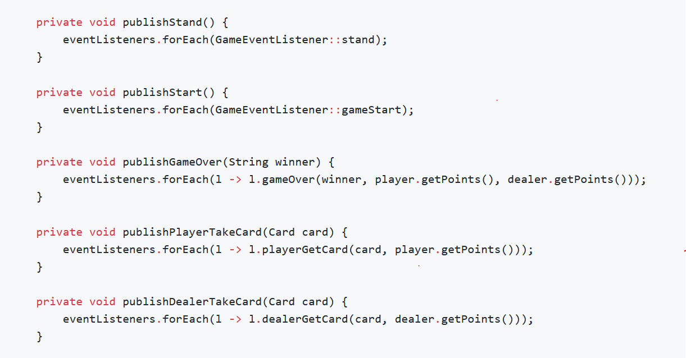
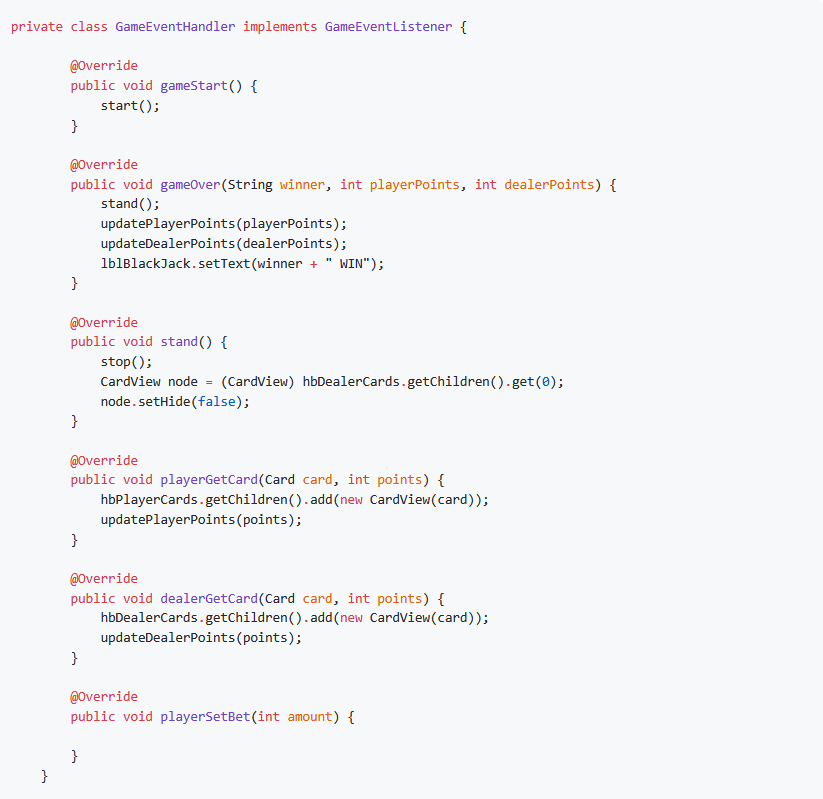

# Практическое задание

В этом практическом задании необходимо реализовать полнофункциональную версию игры [BlackJack](https://ru.wikipedia.org/wiki/%D0%91%D0%BB%D1%8D%D0%BA%D0%B4%D0%B6%D0%B5%D0%BA)

Часть приложения уже написана. 

Диаграмма классов сейчас выглядит следующим образом:

[](img/diagramm_full.png)

**Примечание: кликните по диаграмме для получения полной диаграммы с методами и полями**

В проекте уже реализована логика игры в виде класса [Game](src/main/java/org/itstep/blackjack/Game.java), который
находится в пакете [org.itstep.blackjack](src/main/java/org/itstep/blackjack)

Также есть описание [интерфейса пользователя](https://ru.wikipedia.org/wiki/%D0%98%D0%BD%D1%82%D0%B5%D1%80%D1%84%D0%B5%D0%B9%D1%81_%D0%BF%D0%BE%D0%BB%D1%8C%D0%B7%D0%BE%D0%B2%D0%B0%D1%82%D0%B5%D0%BB%D1%8F)) 
в файле [blackjack.fxml](src/main/resources/blackjack.fxml).

Контроллер [BlackjackController](src/main/java/org/itstep/blackjack/ui/controller/BlackjackController.java), 
который взаимодействует с `FXML`, также частично реализован. 

Перед вами стоит задача обеспечить взаимодействие между классом [Game](src/main/java/org/itstep/blackjack/Game.java)
и [BlackjackController](src/main/java/org/itstep/blackjack/ui/controller/BlackjackController.java).

Для этого мы будем использовать известный паттерн проектирования [наблюдатель](https://refactoring.guru/ru/design-patterns/observer).

Необходимо выполнить следующие шаги:

1. Создайте в пакете [org.itstep.blackjack.event](src/main/java/org/itstep/blackjack/event) интерфейс 
   слушателя игровых событий `GameEventListener`:


[comment]: <> (```java)

[comment]: <> (public interface GameEventListener {)

[comment]: <> (    void gameStart&#40;&#41;;)

[comment]: <> (    void stand&#40;&#41;;)

[comment]: <> (    void playerGetCard&#40;Card card, int points&#41;;)

[comment]: <> (    void dealerGetCard&#40;Card card, int points&#41;;)

[comment]: <> (    void playerSetBet&#40;int amount&#41;;)

[comment]: <> (    void gameOver&#40;String winner, int playerPoints, int dealerPoints&#41;;)

[comment]: <> (})

[comment]: <> (```)

2. В классе [Game](src/main/java/org/itstep/blackjack/Game.java) объявляем список слушателей типа`GameEventListener`:


[comment]: <> (```java)

[comment]: <> (private final List<GameEventListener> eventListeners;)

[comment]: <> (```)

Инициализируйте его в конструкторе класса [Game](src/main/java/org/itstep/blackjack/Game.java).

3. Для добавления слушателей реализуйте метод:


[comment]: <> (```java)

[comment]: <> (public void addGameEventListener&#40;GameEventListener eventHandler&#41; {)

[comment]: <> (        eventListeners.add&#40;eventHandler&#41;;)

[comment]: <> (})

[comment]: <> (```)

4. Добавьте методы для публикации событий в игре:



[comment]: <> (```java)

[comment]: <> (    private void publishStand&#40;&#41; {)

[comment]: <> (        eventListeners.forEach&#40;GameEventListener::stand&#41;;)

[comment]: <> (    })

[comment]: <> (    private void publishStart&#40;&#41; {)

[comment]: <> (        eventListeners.forEach&#40;GameEventListener::gameStart&#41;;)

[comment]: <> (    })

[comment]: <> (    private void publishGameOver&#40;String winner&#41; {)

[comment]: <> (        eventListeners.forEach&#40;l -> l.gameOver&#40;winner, player.getPoints&#40;&#41;, dealer.getPoints&#40;&#41;&#41;&#41;;)

[comment]: <> (    })

[comment]: <> (    private void publishPlayerTakeCard&#40;Card card&#41; {)

[comment]: <> (        eventListeners.forEach&#40;l -> l.playerGetCard&#40;card, player.getPoints&#40;&#41;&#41;&#41;;)

[comment]: <> (    })

[comment]: <> (    private void publishDealerTakeCard&#40;Card card&#41; {)

[comment]: <> (        eventListeners.forEach&#40;l -> l.dealerGetCard&#40;card, dealer.getPoints&#40;&#41;&#41;&#41;;)

[comment]: <> (    })

[comment]: <> (```)

5. Вызовите необходимые методы для публикации всех слушателей о ходе игры в `hit()`, `stand()` и `play()`.
Внимательно читайте комментарии

6. В классе [BlackjackController](src/main/java/org/itstep/blackjack/ui/controller/BlackjackController.java) 
   создайте [внутренний класс](https://ru.wikipedia.org/wiki/%D0%92%D0%BD%D1%83%D1%82%D1%80%D0%B5%D0%BD%D0%BD%D0%B8%D0%B9_%D0%BA%D0%BB%D0%B0%D1%81%D1%81) `GameEventHandler`:



[comment]: <> (```java)

[comment]: <> (private class GameEventHandler implements GameEventListener {)

[comment]: <> (        @Override)

[comment]: <> (        public void gameStart&#40;&#41; {)

[comment]: <> (            start&#40;&#41;;)

[comment]: <> (        })

[comment]: <> (        @Override)

[comment]: <> (        public void gameOver&#40;String winner, int playerPoints, int dealerPoints&#41; {)

[comment]: <> (            stand&#40;&#41;;)

[comment]: <> (            updatePlayerPoints&#40;playerPoints&#41;;)

[comment]: <> (            updateDealerPoints&#40;dealerPoints&#41;;)

[comment]: <> (            lblBlackJack.setText&#40;winner + " WIN"&#41;;)

[comment]: <> (        })

[comment]: <> (        @Override)

[comment]: <> (        public void stand&#40;&#41; {)

[comment]: <> (            stop&#40;&#41;;)

[comment]: <> (            CardView node = &#40;CardView&#41; hbDealerCards.getChildren&#40;&#41;.get&#40;0&#41;;)

[comment]: <> (            node.setHide&#40;false&#41;;)

[comment]: <> (        })

[comment]: <> (        @Override)

[comment]: <> (        public void playerGetCard&#40;Card card, int points&#41; {)

[comment]: <> (            hbPlayerCards.getChildren&#40;&#41;.add&#40;new CardView&#40;card&#41;&#41;;)

[comment]: <> (            updatePlayerPoints&#40;points&#41;;)

[comment]: <> (        })

[comment]: <> (        @Override)

[comment]: <> (        public void dealerGetCard&#40;Card card, int points&#41; {)

[comment]: <> (            hbDealerCards.getChildren&#40;&#41;.add&#40;new CardView&#40;card&#41;&#41;;)

[comment]: <> (            updateDealerPoints&#40;points&#41;;)

[comment]: <> (        })

[comment]: <> (        @Override)

[comment]: <> (        public void playerSetBet&#40;int amount&#41; {)

[comment]: <> (        })

[comment]: <> (    })

[comment]: <> (```)

7. В конструкторе класса [BlackjackController](src/main/java/org/itstep/blackjack/ui/controller/BlackjackController.java) 
   создайте экземпляр внутреннего класса и передайте его в метод `addEventListener()` объекта `game`:


[comment]: <> (```java)

[comment]: <> (game.addGameEventListener&#40;new GameEventHandler&#40;&#41;&#41;;)

[comment]: <> (```)

8. Проверьте работу игры

Дополнительное задание: Добавьте ставки в игре

## Ссыкли

* [Наблюдатель](https://refactoring.guru/ru/design-patterns/observer)
* [JavaFX Documentation Project](https://fxdocs.github.io/docs/book.pdf)
* [Getting Started with JavaFX](https://docs.oracle.com/javase/8/javase-clienttechnologies.htm)
* [JavaFX: Working with JavaFX UI Components](https://docs.oracle.com/javase/8/javafx/user-interface-tutorial/ui_controls.htm)
* [Учебник по JavaFX](https://code.makery.ch/ru/library/javafx-tutorial/)
* [Graphical user interfaces](https://java-programming.mooc.fi/part-13)
* [JavaFX Tutorial: Getting started](https://www.vojtechruzicka.com/javafx-getting-started/)
